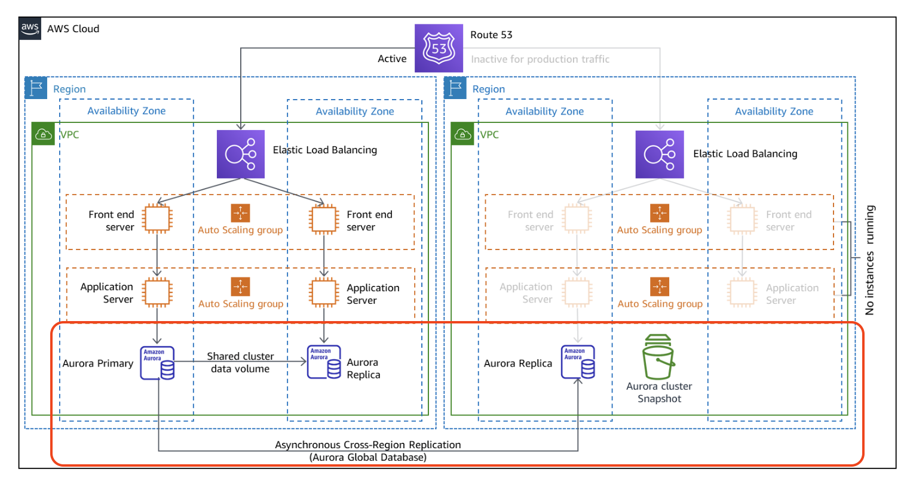

# Database Data Recovery Plan

- Database Recovery Strategy Objectives
- The different Database Recovery Strategies
- Implementation examples
- Detect (Alarms), Restore (Backups) and Failover (Triggers)
- Documentation
- Staff training
- Conclusions

---
# Database Recovery Strategy Objectives
Database Disaster recovery is a very important process to ensure business continuity for a company, there are many impacts when we have a database outage which can lead to severe money or reputation loss for the company.
There are two criteria that will determine the Disaster Recovery strategy that we will put in place
When a Database is faulty, the failover process is not instantaneous, the replication happens over the network and there is no guarantee that the integrity between the active and the backup database is in sync, there for, we must set RPO and RTO objectives 

---
# Database Recovery Strategy Objectives

---
## RPO (Recovery Point Objective)
The maximum acceptable amount of time since the last data recovery point. This determines what is considered an acceptable loss of data.
## RTO (Recovery Time Objective)
The maximum acceptable delay between the interruption of service and restoration of service. This determines an acceptable length of time for service downtime.

---
# The different Database Recovery Strategies

---
# Implementation examples
Before we talk about different architectures for Database Recovery, let's mention our constraints:
1- Data must stay within the country for legal compliance, Amazon have a data center in Canada
2- We must have a geographical redundancy, Amazon only have one data center in Canada (second one in Calgary soon), but there are multiple Availability Zones that we can use for Geographical redundancy

---
# Implementation examples
## Backup & Restore
Note: we do not use another region, we use AZ

---
# Implementation examples
## Pilot Light
Note: we do not use another region, we use AZ

---
# Implementation examples
## Warm StandBy
Note: we do not use another region, we use AZ

---
# Implementation examples
## Active/Active
This is the same as Warm StandBy but all application servers are active. Both main setup and backup setup can support production traffic

---
# Implementation

---
# Detect
We must put in place monitoring and alarms to detect when a Database is at fault so we can switch the backup database, there are multiple ways to detect a failure:
- Amazon CloudWatch
- Service API health checks, error rates and latency
- Collect service data using Amazon CloudWatch Synthetics
- Workload Key performance indicators i.e. number of active sessions

---
# Restore
We have to automate the snapshot creation using AWS CLI or Terraform, we can set snapshots to be taken daily, hourly or any other interval that would allow us to have a shorter RPO.

---
# Failover
Failover will redirect the traffic from main database instance to the backup database instance, we can use a manual trigger (GitHub Action) in order to do the failover. 
The process involve mostly two actions:
1- Trigger the failover using the AWS CLI
2- Restart all containers that were connected to main database to reset TCP connections, we have seen in many cases where we have timeout errors but the socket remain active even if the database is not responding.

---
# Documentation
We must maintain a thorough documentation about the disaster recovery process
A Run Book should be created when we setup the DRP
The Run Book must be verified and maintained by the platform team
Any changes to the architecture must validate the DRP

---
# Staff training
All engineers on-call must be trained to do a failover and use the DRP
Chaos Engineering simulation is a good practice to get every engineer on call used to the DRP, where to find it, how to use it and how to make sure that things are verified and working as expected
In case of data loss (according to the RPO), we should define mitigation plans for the future
In case of service being not available (RTO), we should notify users and stake holders about the interruption and when the system is back online.

---
# Conclusions
In order to come up with a good Database Disaster Recovery plan, we need to set our RPO and RTO objectives that align best with the company goals and SLA.
Many architectures can achieve a disaster recovery, the choice must align with the PRO and RTO that we have set, the less data we want to lose and the least time we want to be back online will cost more. This is an important aspect of the choice we have to make.
We can control the failover using Github Actions with runners that execute the AWS CLI commands necessary
It's very important to document and practice the disaster recovery exercise, teams should be able to do at any point in time when an emergency arise
Monitoring and alerting are a very important piece to detect a malfunctioning Database so we can trigger the failover

---
# References
- https://docs.aws.amazon.com/whitepapers/latest/disaster-recovery-workloads-on-aws/disaster-recovery-options-in-the-cloud.html
- https://aws.amazon.com/blogs/architecture/disaster-recovery-dr-architecture-on-aws-part-i-strategies-for-recovery-in-the-cloud/
- https://registry.terraform.io/providers/hashicorp/aws/latest/docs/data-sources/availability_zones
- https://registry.terraform.io/providers/hashicorp/aws/latest/docs/resources/rds_global_cluster
- https://medium.com/techhappily/amazon-aurora-cluster-snapshot-with-github-action-c7507dddf46d

